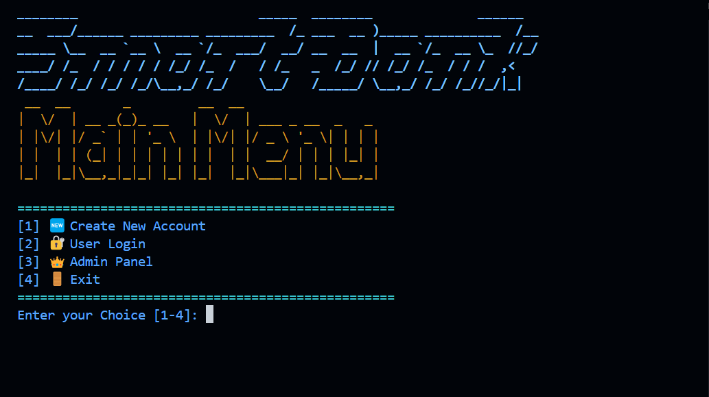
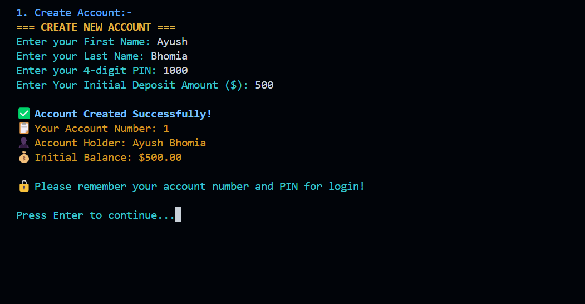
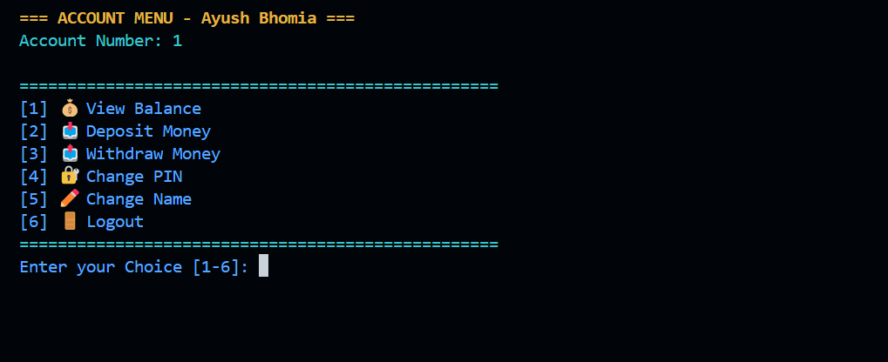
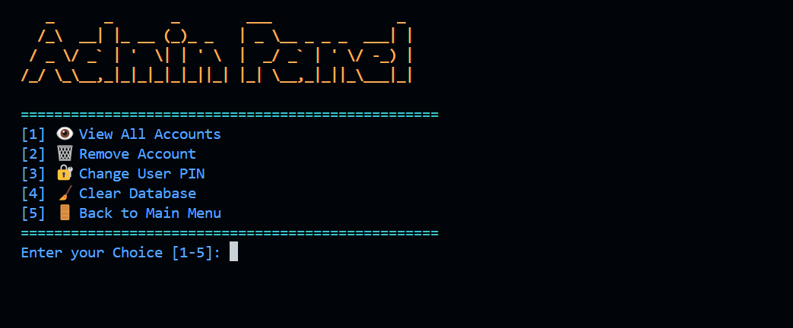

# 🏦 Smart Bank System


## 📋 Overview
A comprehensive console-based banking application written in Python with SQLite database integration. Features a complete user interface with colorful menus, secure account management, and administrative controls.

## 🗂️ Project Structure
```
📁 Smart Bank/
↪    ├── 📄 main.py              - Application entry point with startup sequence
↪    ├── 📄 account.py           - Core banking operations and database models  
↪    ├── 📄 interface.py         - User interface and menu systems
↪    ├── 📄 admin.py             - Administrative panel and functions
↪    ├── 📄 utils.py             - Utility functions (optional helpers)
↪    ├── 📄 DOCUMENTATION.txt    - Detailed technical documentation
└── 📄 database.db          - SQLite database (auto-generated)
└── 📄 README.md            - Project documentation
└── 📁 screenshots/          - Screenshots of the application's functionality
```


## ✨ Features

### 👤 User Features:
- ✅ **Account Creation** - Create new bank accounts with validation
- ✅ **Secure Login** - Account number + PIN authentication
- ✅ **Balance Inquiry** - View current account balance
- ✅ **Money Deposits** - Add funds to account
- ✅ **Money Withdrawals** - Withdraw funds with balance validation
- ✅ **PIN Management** - Change account PIN securely
- ✅ **Profile Updates** - Update first and last name
- ✅ **Colorful Interface** - Beautiful console UI with colors

### 👑 Admin Features (PIN: 2008):
- ✅ **Account Overview** - View all accounts with balances
- ✅ **Account Removal** - Delete user accounts with confirmation
- ✅ **PIN Reset** - Change any user's PIN (admin override)
- ✅ **Database Management** - Clear entire database with triple confirmation
- ✅ **Administrative Reports** - Total accounts and bank balance summary

## 🛠️ Technical Features:
- **SQLite Database** - Persistent data storage with constraints
- **Input Validation** - Comprehensive validation for all user inputs
- **Error Handling** - Graceful error handling with user-friendly messages
- **Security** - PIN uniqueness, SQL injection prevention
- **Cross-Platform** - Works on Windows, macOS, and Linux

## 🚀 Quick Start

### Prerequisites
```bash
pip install colorama
```

### Installation & Running
```bash
# Clone or download the project
cd "Smart Bank"

# Run the application
python main.py
```

## 📸 Screenshots

### 🏠 Main Menu

*The colorful main menu with ASCII art banner and navigation options*

### 🆕 Account Creation

*User-friendly account creation process with input validation*

### 🔐 Account Login

*Secure login interface with account number and PIN verification*

### 👑 Admin Panel

*Administrative interface with account management options*

## 🎯 Usage Guide

### Creating Your First Account:
1. **Run the application**: `python main.py`
2. **Select option [1]**: Create New Account
3. **Enter your details**: First name, last name (minimum 2 characters each)
4. **Set your PIN**: Choose a unique 4-digit PIN
5. **Initial deposit**: Enter your starting balance (can be $0)
6. **Save your account number**: You'll need this to login

### Banking Operations:
1. **Login**: Use your account number and PIN
2. **Deposit Money**: Add funds to your account
3. **Withdraw Money**: Remove funds (sufficient balance required)
4. **Check Balance**: View your current account balance
5. **Update Profile**: Change your PIN or name

### Admin Access:
1. **Select option [3]**: Admin Panel
2. **Enter Admin PIN**: 2008
3. **Manage accounts**: View, modify, or delete user accounts

## 🔒 Security Features

- **Unique PIN System**: Each account requires a unique 4-digit PIN
- **Input Validation**: All inputs are validated for type and format
- **SQL Injection Protection**: Parameterized queries prevent database attacks
- **Admin Authentication**: Separate PIN protection for administrative functions
- **Confirmation Prompts**: Destructive operations require explicit confirmation

## 📊 Database Schema

```sql
CREATE TABLE Accounts (
    Acc_Number INTEGER PRIMARY KEY,           -- Auto-generated account number
    First_Name TEXT NOT NULL CHECK(length(First_Name) >= 2),
    Last_Name TEXT NOT NULL CHECK(length(Last_Name) >= 2),
    Pin TEXT NOT NULL UNIQUE CHECK(length(Pin) = 4 AND Pin GLOB '[0-9][0-9][0-9][0-9]'),
    Balance REAL DEFAULT 0 CHECK(Balance >= 0),
    Creation_Date TEXT DEFAULT CURRENT_TIMESTAMP
);
```

## 🐛 Troubleshooting

### Common Issues:

**"Module 'colorama' not found"**
```bash
pip install colorama
```

**Database errors**
- Delete `database.db` file - it will be recreated automatically

**PIN already exists**
- Choose a different 4-digit PIN during account creation

**Screen clearing issues**
- Ensure your terminal supports `cls` (Windows) or `clear` (Unix) commands

## 📈 Project Statistics

- **Total Files**: 6 Python files
- **Lines of Code**: ~800+ lines
- **Database**: SQLite with 1 table
- **Features**: 15+ implemented features
- **Completion**: 100% functional

## 🔧 Technical Implementation

### Architecture:
- **Model-View-Controller (MVC)** pattern
- **Object-Oriented Programming** with BankAccount class
- **Separation of Concerns** across different modules
- **Database Abstraction Layer** for data persistence

### Key Components:
- **main.py**: Application entry point and startup sequence
- **account.py**: Business logic and database operations
- **interface.py**: User interface and input handling
- **admin.py**: Administrative functionality and controls

## 📝 Documentation

For detailed technical documentation including all functions, classes, and implementation details, see:
- **[DOCUMENTATION.txt](Smart Bank/DOCUMENTATION.txt)** - Complete technical reference

## 🚧 Future Enhancements

Potential features for future versions:
- 📈 **Transaction History** - Track all account activities
- 💹 **Interest Calculation** - Automatic interest on savings
- 🏦 **Account Types** - Savings, Checking, Business accounts
- 💸 **Transfer System** - Money transfers between accounts
- 📱 **GUI Interface** - Graphical user interface
- 🌐 **Web Interface** - Browser-based banking
- 📧 **Email Notifications** - Transaction alerts
- 📊 **Reports & Analytics** - Financial reports and insights

## 👨‍💻 Development

This project demonstrates:
- Python programming best practices
- Database design and operations
- User interface design
- Input validation and error handling
- Security implementation
- Documentation and code organization

## 📄 License

This project is created for educational purposes. Feel free to use, modify, and learn from the code.

---

**Created**: June 2025  
**Version**: 1.0  
**Status**: Complete and Functional ✅

For technical support or questions about implementation, refer to the DOCUMENTATION.txt file.
